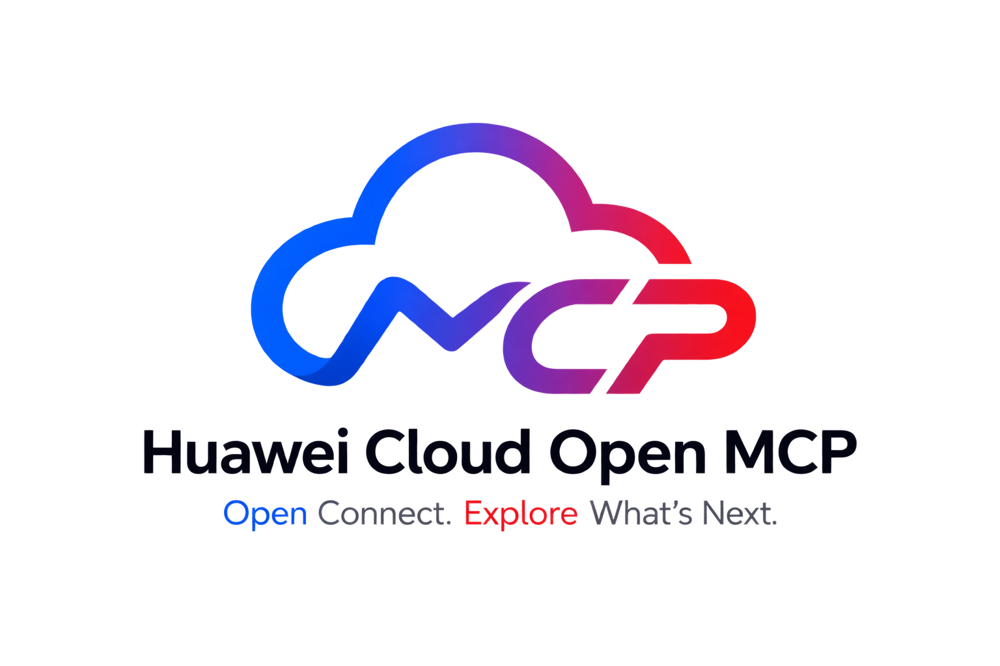

<div align="center">
  
  <p><sub>English | <a href="README.zh-CN.md">中文</a></sub></p>
</div>

# Huawei Cloud Open MCP

**Open Connect. Explore What's Next.**

One open, local stdio [Model Context Protocol](https://modelcontextprotocol.io) server connects code agents — opencode, Codex, Cursor, and any other MCP-capable client — to Huawei Cloud in natural language. No per-service wrappers: the agent explores the full catalog (300+ products, 17,000+ APIs) step by step, narrowing it down to one concrete API call, executed with locally signed requests. Your AK/SK never leave your machine.

An experimental second mode that discovers and connects to cloud-hosted Huawei Cloud MCP servers is under development and not documented yet.

## How it works

- **Progressive workflow** — the agent explores step by step: `list_products → get_product → list_apis → get_api → (get_api_examples) → execute_api`, narrowing 17,000+ APIs to one concrete call. Each step keeps the LLM context bounded; the full guide is baked into the server instructions.
- **Metadata-driven, zero SDK** — API metadata is fetched live from Huawei Cloud API Explorer and cached in memory; requests are signed locally (SDK-HMAC-SHA256, self-implemented) and sent straight to Huawei Cloud.
- **Secure by default** — every `execute_api` must pass a safety policy (allowlist/denylist); with no policy configured, everything is denied. Rules hot-reload, and the agent can request minimal grants via `manage_policy`.
- **OBS object data plane via presigned URLs** — upload/download APIs return a presigned-URL envelope; the client streams bytes directly to OBS with no size limit and the gateway never touches the data.

## Quick start

Connect once — your agent explores the rest.

### Prerequisites

- Python 3.10+ and [uv](https://docs.astral.sh/uv/) on your PATH (or `pip`)
- A code agent: [opencode](https://opencode.ai) or [Codex](https://developers.openai.com/codex/) — any MCP-capable client works
- A Huawei Cloud Access Key (AK/SK) from a **minimal-privilege IAM sub-user** (recommended: read-only permissions for what you plan to query)
- Network access to `apiexplorer.cn-north-4.myhuaweicloud.com`

### Step 1 — Provide credentials

The gateway reads your AK/SK from `~/.huaweicloud/credentials` (INI format, `[basic]` section). See [Credentials](#credentials) for the alternative inline-environment-variable way.

**Input:**

```bash
mkdir -p ~/.huaweicloud
cat > ~/.huaweicloud/credentials <<'EOF'
[basic]
ak = your-access-key-id
sk = your-secret-access-key
EOF
chmod 600 ~/.huaweicloud/credentials
cat ~/.huaweicloud/credentials
```

**Output:**

```ini
[basic]
ak = your-access-key-id
sk = your-secret-access-key
```

Optional keys (uncomment as needed): `security_token` (temporary credentials), `project_id` (auto-resolved when unset), `domain_id` (global-level services; full support in progress). `chmod 600` is recommended — the file holds your secret. The server reads this file at startup; the log line `server start: ... credentials=configured` (see `--log-file`) confirms it was picked up.

### Step 2 — Create a read-only safety policy

The gateway refuses every `execute_api` call unless a policy file explicitly allows it; with no policy configured, everything is denied.

**Input:**

```bash
printf '[\n  "ECS:*List*=allow",\n  "*=deny"\n]\n' > "$HOME/hwc-policy.json"
echo "$HOME/hwc-policy.json"
cat "$HOME/hwc-policy.json"
```

**Output:**

```text
/home/you/hwc-policy.json
```

```json
[
  "ECS:*List*=allow",
  "*=deny"
]
```

Each rule reads `product:apiPattern=allow|deny` — fnmatch-style wildcards, case-insensitive, `#` lines are comments. Rules are evaluated top-down and the first match wins, so this file allows every ECS API whose name contains `List` and denies everything else. Clients need the **absolute** path (printed above) because they spawn the server with their own working directory.

### Step 3 — Register the gateway with your code agent

**opencode** — add to `opencode.json` (project) or `~/.config/opencode/opencode.json` (global):

```json
{
  "mcp": {
    "huaweicloud": {
      "type": "local",
      "command": [
        "uvx", "huaweicloud-open-mcp",
        "--policy", "/home/you/hwc-policy.json"
      ],
      "enabled": true
    }
  }
}
```

**Codex** — add to `~/.codex/config.toml` or run:

```bash
codex mcp add huaweicloud -- \
  uvx huaweicloud-open-mcp --policy /home/you/hwc-policy.json
```

```toml
[mcp_servers.huaweicloud]
command = "uvx"
args = ["huaweicloud-open-mcp", "--policy", "/home/you/hwc-policy.json"]
```

**Output:** start your agent — the seven gateway tools appear, prefixed with your server name (`huaweicloud_list_products`, `huaweicloud_get_product`, `huaweicloud_list_apis`, `huaweicloud_get_api`, `huaweicloud_get_api_examples`, `huaweicloud_execute_api`, `huaweicloud_manage_policy`). In Codex, `codex mcp list` shows the server and `/mcp` in the TUI confirms it is connected.

Credentials come from Step 1 — no secrets in the client config. If you prefer inline environment variables instead, see [Credentials](#credentials).

### Step 4 — Browse the catalog (first real call)

**Input** (say to your agent):

> List the available Huawei Cloud products.

The agent calls `list_products`, which fetches live metadata from Huawei Cloud API Explorer.

**Output** (abridged):

```json
{
  "ok": true,
  "total": 310,
  "products": [
    { "product": "ECS", "name": "弹性云服务器", "category": "计算",
      "link": "https://www.huaweicloud.com/product/ecs.html" },
    { "product": "EVS", "name": "云硬盘", "category": "存储",
      "link": "https://www.huaweicloud.com/product/evs.html" }
  ]
}
```

### Step 5 — Execute a real read-only API

**Input** (say to your agent):

> List my ECS servers in cn-north-4.

The agent runs the progressive workflow — `list_apis(ECS)` to find the API, `get_api` to read its parameters, then `execute_api`, which signs the request with your AK/SK and sends it to real Huawei Cloud.

**Output** (abridged):

```json
{
  "ok": true,
  "product": "ECS",
  "api": "ListServersDetails",
  "status": 200,
  "body": {
    "servers": [
      { "name": "ecs-01", "status": "ACTIVE", "id": "1d4e…" }
    ],
    "count": 2
  }
}
```

`"count": 0` with an empty `servers` list is also a success — your account simply has no instances in that region; ask again with another `region` (for example `cn-east-3`).

On security: requests are signed locally and your SK never leaves your machine; the policy file confines the agent to read-only ECS `List*` APIs. Widen it deliberately, one pattern at a time — see [Safety policy](#safety-policy).

### No account yet? Mock mode

Run the same flow without credentials: skip Step 1, and add `--mock` to the server command in Step 3 (`uvx huaweicloud-open-mcp --mock --policy /home/you/hwc-policy.json`).

**Output:** Step 4 works identically — the product catalog is real metadata. Step 5 returns simulated server data shaped exactly like the real response (mock endpoint, no Huawei Cloud account involved).

## Tools (openapi mode)

| Tool | Purpose |
| --- | --- |
| `list_products` | Full Huawei Cloud product catalog — identifier, display name, category, product link; `keyword`/`category` filter |
| `get_product` | One product's details (classification, API count, global vs regional) |
| `list_apis` | A product's API directory with `tag_groups` overview; `tag`/`search`/`limit`/`offset` to narrow |
| `get_api` | One API's full documentation (parameters, required fields, enums, constraints) — read before executing |
| `get_api_examples` | Official request examples for one API |
| `execute_api` | Execute one API: path/query params flattened, request body under `body`; errors come back structured, 429 retried with backoff |
| `manage_policy` | Read/add/remove safety-policy rules at runtime (hot effect, no restart) |

## Safety policy

A policy file is a JSON array (or plain text) of rules, evaluated top-down, first match wins:

```json
[
  "ECS:*List*=allow",
  "VPC:*Show*=allow",
  "*=deny"
]
```

- Rule format `product:apiPattern=allow|deny` — fnmatch-style wildcards, case-insensitive product/API, `#` lines are comments.
- No `--policy` configured → every execution denied.
- Grant scopes (via `manage_policy` add): `once` (single execution, burned after use) · `session` (default; this agent session only) · `temporary` (TTL) · `permanent` (written to the policy file).
- Hot everywhere: external edits to the file apply immediately; add/remove via `manage_policy` too. Grant minimal rules first (`once`/`session`), product-wide only when justified.
- Denials return an actionable reason; with `--elicitation auto|required` the server proposes a minimal grant over MCP elicitation. Default is `off` for predictable cross-client behavior.

A richer example ships with the package: `configs/safety-policy.example.json`.

## Configuration

### CLI flags

| Flag | Default | Description |
| --- | --- | --- |
| `--mock` | off | Point `execute_api` at the API Explorer mock endpoint (no credentials needed) |
| `--policy <file>` | — | Safety policy file; missing → all executions denied |
| `--region <id>` | `cn-north-4` | Default region |
| `--gate <file>` | — | Optional product gate (allowlist; unlisted products are hidden from the agent) |
| `--elicitation auto\|required\|off` | `off` | MCP-elicitation confirmation for policy changes |
| `--audit-file <file>` | disabled | Audit trail (NDJSON): one `{ts, tool, input, ok}` line per tool call |
| `--log-level` / `--log-file` | `INFO` / `logs/huaweicloud-open-mcp.log` | Logging (rotating file; stderr mirrors WARNING+) |

### Environment variables

| Variable | Purpose |
| --- | --- |
| `HUAWEICLOUD_SDK_AK` / `HUAWEICLOUD_SDK_SK` | Access key / secret key (real mode); see [Credentials](#credentials) for the profile-file alternative |
| `HUAWEICLOUD_SDK_SECURITY_TOKEN` | Optional temporary-security-credential token |
| `HUAWEICLOUD_SDK_PROJECT_ID` | Optional; resolved automatically when unset |
| `HUAWEICLOUD_SDK_DOMAIN_ID` | Optional; loaded for global-level services (full support in progress) |
| `HUAWEICLOUD_MCP_POLICY_FILE` | Same as `--policy` |
| `HUAWEICLOUD_MCP_OPENAPI_GATE` | Same as `--gate` |
| `HUAWEICLOUD_MCP_AUDIT_FILE` | Same as `--audit-file` |
| `HUAWEICLOUD_MCP_MOCK_BASE` | Mock endpoint base URL override |
| `HUAWEICLOUD_MCP_LOG_LEVEL` / `HUAWEICLOUD_MCP_LOG_FILE` | Same as `--log-level` / `--log-file` |

## Credentials

The gateway loads AK/SK from two sources, checked in order: **environment variables → `~/.huaweicloud/credentials`**. When both are configured, environment variables win.

### Option A — Profile file (quick-start main path)

`~/.huaweicloud/credentials` — exactly what [Step 1](#step-1--provide-credentials) creates:

```ini
[basic]
ak = your-access-key-id
sk = your-secret-access-key

# optional — uncomment as needed:
# security_token = <temporary-security-token>
# project_id = <project-id>
# domain_id = <domain-id>
```

- `[basic]` section with `ak` and `sk` is required; the three optional keys mirror the environment variables below.
- A missing file is silently skipped — the server simply runs without credentials (metadata tools keep working; see below).
- Keep it private: `chmod 600 ~/.huaweicloud/credentials`.

### Option B — Environment variables (inline in client registration)

Set them in the client registration instead of the profile file:

**opencode** — add an `environment` block next to `command`:

```json
"environment": {
  "HUAWEICLOUD_SDK_AK": "your-access-key-id",
  "HUAWEICLOUD_SDK_SK": "your-secret-access-key"
}
```

**Codex** — add `--env` flags before `--`:

```bash
codex mcp add huaweicloud \
  --env HUAWEICLOUD_SDK_AK=your-access-key-id \
  --env HUAWEICLOUD_SDK_SK=your-secret-access-key \
  -- uvx huaweicloud-open-mcp --policy /home/you/hwc-policy.json
```

| Variable | Purpose |
| --- | --- |
| `HUAWEICLOUD_SDK_AK` / `HUAWEICLOUD_SDK_SK` | Required pair |
| `HUAWEICLOUD_SDK_SECURITY_TOKEN` | Optional temporary-security-credential token |
| `HUAWEICLOUD_SDK_PROJECT_ID` | Optional; resolved automatically when unset |
| `HUAWEICLOUD_SDK_DOMAIN_ID` | Optional; loaded for global-level services (full support in progress) |

### Behavior notes

- Without credentials, metadata tools (`list_products`, `list_apis`, `get_api`, …) keep working — their data comes from the public API Explorer. Only `execute_api` needs credentials.
- Use a dedicated minimal-privilege IAM sub-user's AK/SK — the gateway can then only do what that user could do anyway.
- Signing happens locally; the SK never leaves your machine, and credentials never appear in logs.

## Troubleshooting

| Symptom | Likely cause | Fix |
| --- | --- | --- |
| Client shows "failed to connect" or the server exits immediately | `--policy` path is relative or the file is missing — the server fails fast on a bad policy file | Use an absolute path to a file that exists |
| The seven tools never appear in the agent | `uvx` is not on the client's PATH | Find it with `which uvx` and use the absolute path in place of `uvx` in the command |
| Metadata tools work but `execute_api` fails | Credentials not loaded (empty `[basic]` section, or env vars shadow an empty file) | Fix `~/.huaweicloud/credentials` (see [Credentials](#credentials)) or set the `HUAWEICLOUD_SDK_*` environment variables |
| `execute_api` returns `{"ok": false, "reason": ...}` mentioning policy | The API is not allowed by the policy file (the quick-start file allows only `ECS:*List*`) | Edit the policy file — changes hot-reload without restarting the server — or, after confirming with the user, have the agent add a rule via `manage_policy` |
| 401 / SignatureDoesNotMatch | Wrong AK or SK | Recheck the credentials source in use (env wins over profile file) |
| 403 from Huawei Cloud with a permission error | The IAM user lacks the permission | Grant the minimal IAM policy needed for that API |
| `"count": 0` but you have servers | Resources live in another region | Ask again with an explicit `region`, e.g. `cn-east-3` |
| Mock calls hang or time out | No network route to the API Explorer endpoint | Check proxy/firewall access to `apiexplorer.cn-north-4.myhuaweicloud.com` |

For deeper diagnosis, add `--log-level DEBUG --log-file /tmp/hwc-mcp.log` to the registration command and inspect the log file.

## Documentation

Explore the design behind the gateway:

| Document | Type | Language |
| --- | --- | --- |
| [docs/architecture.md](docs/architecture.md) | Design overview (layers, modules, logging, tests) | 中文 |
| [docs/mcp-openapi.md](docs/mcp-openapi.md) | openapi-mode design (workflow, signing, OBS lane) | 中文 |
| [AGENTS.md](AGENTS.md) | Contributor conventions (TDD seams, release flow) | 中文 |
| [benchmarks/README.md](benchmarks/README.md) | Workflow-benchmark design | 中文 |

## Development

```bash
uv sync                                  # deps (incl. dev)
uv run huaweicloud-open-mcp              # run from source
uv run pytest                            # unit + integration (e2e skipped by default)
uv run pytest -m e2e                     # real-credential E2E
uv run ruff check src tests              # lint
uv run mypy src                          # type check
```

Companion CLIs: `api-refresh` (offline APIE pipeline: fetch API Explorer → OpenAPI 2.0 docs) and `api-docs` (metadata queries from the terminal). Details in [AGENTS.md](AGENTS.md).

## License

[Apache-2.0](LICENSE)
