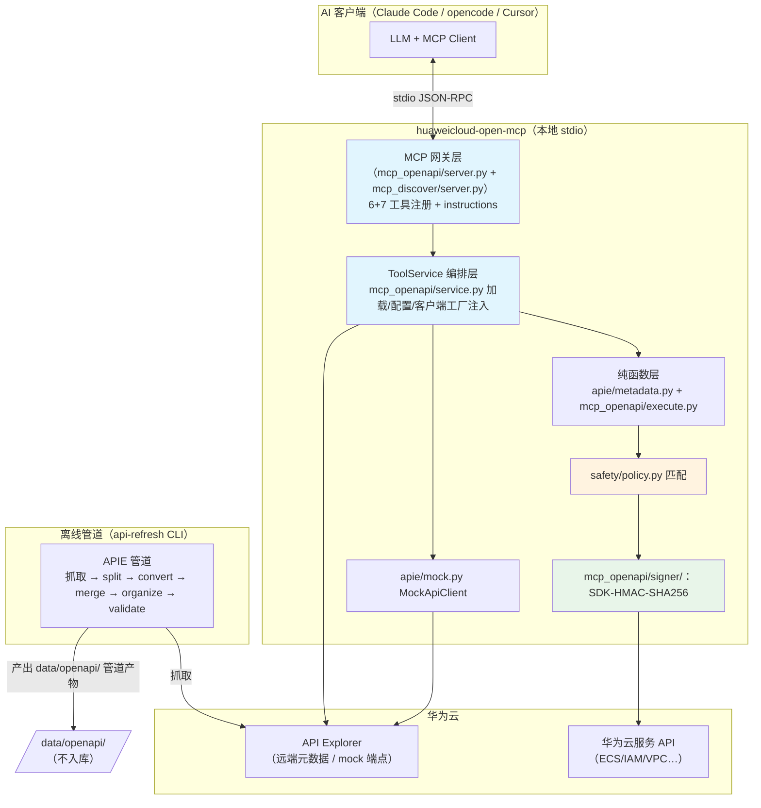
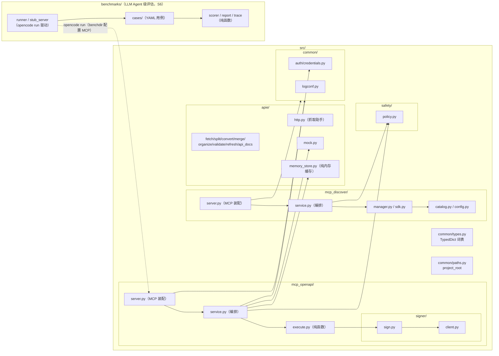
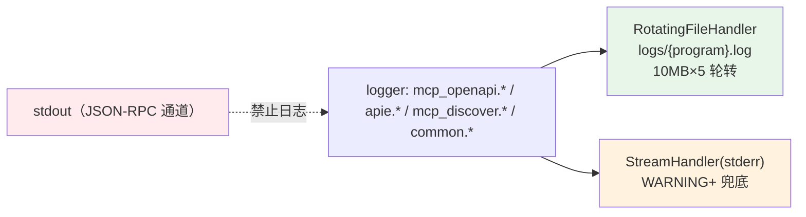

# 华为云 Open MCP 设计文档

> 本地 stdio 形态的华为云 Open MCP server（通用网关 Core 模式）：以最小工具集编排触达华为云全量 OpenAPI / 云端 MCP server，供 AI 客户端（Claude Code / opencode / Cursor 等）通过自然语言查询与调用。同类产品参考：[阿里云 OpenAPI MCP Server](https://github.com/aliyun/alibabacloud-api-mcp-server)（Core 模式）、[AWS Labs MCP](https://github.com/awslabs/mcp)。

两种运行模式（`--mode` 二选一），各自有独立设计文档：

| 模式 | 工具集 | 设计文档 |
| --- | --- | --- |
| **openapi**（默认） | 6 工具直连华为云 OpenAPI | [mcp-openapi.md](mcp-openapi.md) |
| **discover** | 7 工具发现连接云端 MCP server | [mcp-discovery.md](mcp-discovery.md) |

本文档覆盖跨模式共享的内容：总体架构、模块组织、日志、测试纪律、能力清单与路线。

## 1. 总体架构

分层职责：

| 层 | 模块 | 职责 | 依赖方向 |
| --- | --- | --- | --- |
| 网关 | `main.py` / `mcp_openapi/server.py` / `mcp_discover/server.py` | CLI 入口汇聚 + MCP 协议装配（stdio、工具 schema、instructions） | → service |
| 编排 | `mcp_openapi/service.py` / `mcp_discover/service.py` | 数据加载、配置（region/mock/policy/凭证）、客户端工厂注入 | → 纯函数层 / apie / signer |
| 纯函数 | `apie/metadata.py` `mcp_openapi/execute.py` | 元数据处理与请求构建/响应规范化，不碰磁盘、不碰 MCP 协议 | → types |
| 安全 | `safety/policy.py` | policy 解析与匹配（PolicyRule dataclass，product + server 两类规则） | 无依赖 |
| 执行 | `mcp_openapi/signer/` `apie/mock.py` | 签名直连 / mock 端点 | → types / auth |
| 元数据 | `apie/` | APIE 管道（可独立运行）+ 内存缓存（`memory_store.py`）+ 远端回退（`catalog.py`/`live_fallback.py`） | → http |

## 2. 模块组织

模块依赖严格单向、无环（详见 `AGENTS.md`「模块依赖关系」）：

关键设计结论：

- **`apie` 是 `mcp_openapi` 独享依赖**：APIE 元数据层只服务 openapi 直连模式；`mcp_discover` 只依赖 `safety` + `common`，两模式互不 import。
- **`safety` + `common` 是两模式公共底座**，二者本身零内部依赖。
- **`main.py` 延迟导入**：`mcp_openapi.server` / `mcp_discover.server` 在 `main()` 体内按 mode 分支导入，避免同时装载两套。

### 类型设计（结果信封）

- 共享 TypedDict 词表（`common/types.py`）：`ClientResponse` / `ExecuteResult` / `ToolError` + 六工具结果信封（均含 `ok: Literal[True]`）
- 纯函数直接产出完整信封；失败态 `ToolError(ok: Literal[False], reason)` 由编排层构造——服务方法返回 `X | ToolError` 联合
- `ApiDetailResult` 用函数式 TypedDict 承载非标识符键 `x-constraint`
- mypy 全量检查：`disallow_untyped_defs`，41 个源文件 0 错误

## 3. 可观测性（日志）

- **配置**：`logconf.configure_logging(program, level, log_file)`；`--log-level`/`--log-file` 参数与环境变量 `HUAWEICLOUD_MCP_LOG_LEVEL/FILE`；默认 INFO
- **审计（INFO）**：`execute {product}:{api} region=.. mode=real|mock policy=allow|deny|unconfigured`；HTTP 请求 `GET https://host/path -> 200 (123ms)`；server 启动摘要（region/mock/policy/凭证状态）
- **运行（WARNING）**：429 退避重试、policy 拒绝、抓取失败、Swagger 校验 INVALID
- **脱敏红线**：`Authorization`/`X-Security-Token`/AK/SK 永不入日志；请求 body 仅 DEBUG 且截断 500 字符；测试用 caplog 断言红线
- **CLI**：api-refresh/api-docs 全部进度/错误迁至 logging（stderr），stdout 仅保留结构化输出（emit 表格/JSON）

## 4. 测试与 TDD

| 接缝 | 内容 | 测试方式 | 独立真值 |
| --- | --- | --- | --- |
| S1 | `signer.sign(request) → Authorization 头` | 纯函数单测 | 华为云官方 Go SDK 测试向量 |
| S2 | `safety.evaluate(policy, product, api)` | 纯函数单测 | 手写策略文件 + 预期字面量 |
| S3 | 6 工具纯函数 | 单测，迷你样本 fixture | 自建迷你 OpenAPI 片段 |
| S4 | `execute_api` HTTP 边界 | 集成测试直连 mock 端点 + urllib 打桩错误注入 | mock 端点返回 |
| S5 | APIE 管道各阶段 | 单测 + 迷你样本集成 + e2e 全量 | Swagger 2.0 schema |
| S6 | benchmark 纯函数（case 加载校验 / 分层评分 / 统计基线 / trace 提取 / token 读取 / 本地 stub） | 单测（迷你 fixture / 回环 HTTP） | 手写字面量 + 独立构造样例调用序列 |
| S7 | discover 模式（catalog / server 规则 / session 管理 / SDK 适配 / 7 工具） | 见 [mcp-discovery.md](mcp-discovery.md) | 字面量 + 互斥工具集合断言 |
| S8 | openapi 产品门栓 `gate.py`（准入 / 过滤 / 文案）+ service 过滤/拒绝 + server 指令注入 | 见 [mcp-openapi.md](mcp-openapi.md) | 门栓示例配置 + 手写字面量 |

S1–S5 细节见 [mcp-openapi.md](mcp-openapi.md)。纪律：red→green 垂直切片；只 mock 系统边界（外部 HTTP）；期望值来自独立真值，禁止同义反复。

## 5. 已实现能力清单

- [x] APIE 全量管道：219 产品 / 17666 接口 → 2714 OpenAPI 2.0 文档，Swagger 校验 invalid=0
- [x] openapi 模式 6 工具：list_products / get_product / list_apis（含 tag_groups）/ get_api / get_api_examples / execute_api
- [x] discover 模式 7 工具：list_mcp_servers / get_mcp_server / connect / list_server_tools / get_server_tool / call_server_tool / disconnect
- [x] server instructions + 渐进式工作流指引
- [x] SDK-HMAC-SHA256 签名（官方向量 + 真实云验证）
- [x] safety policy（product + server 规则，无 policy 全拒）
- [x] openapi 产品门栓（`Gate`，产品级白名单，提示词 + 元数据层准入）
- [x] mock 模式全链路（`--mock` / `--mock-base`）
- [x] 类型系统：TypedDict 结果信封 + mypy 0 错误
- [x] 263 单测+集成 / 15 e2e（真实凭证 3 + 渐进式工作流 12，`.env` 加载）
- [x] 日志体系：文件为主轮转 + stderr 兜底，execute 审计，脱敏红线
- [x] LLM Agent 级工作流 benchmark（S6）：自然语言用例驱动 opencode，评估精度/耗时/token，stub/real 双后端 + 基线回归（`benchmarks/`）

## 6. 二期路线

- 远程形态：Streamable HTTP + OAuth（分层已预留，service 与协议解耦）
- `wait_job`：ECS 异步 job 轮询固化（当前 LLM 可经 execute_api 自行轮询 QueryJobStatus）
- 全局级服务完善：domain_id 凭证流与 IAM token 支持
- 多 region 执行：非默认 region 元数据批量抓取与运行时切换
- 文档检索工具：类比阿里云 SearchDocument/ReadDocument（华为云帮助文档）
- 自定义版：把高频 API 直接暴露为单工具（收敛后固化）