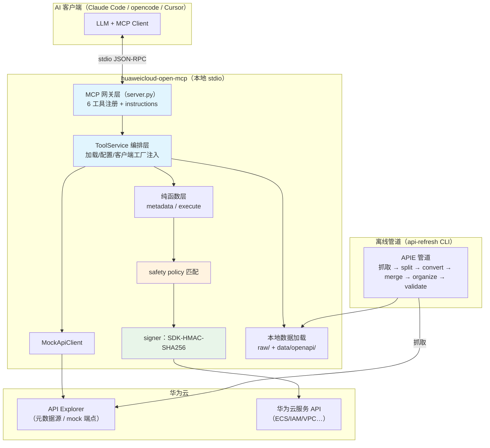
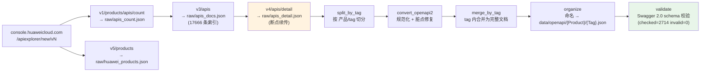
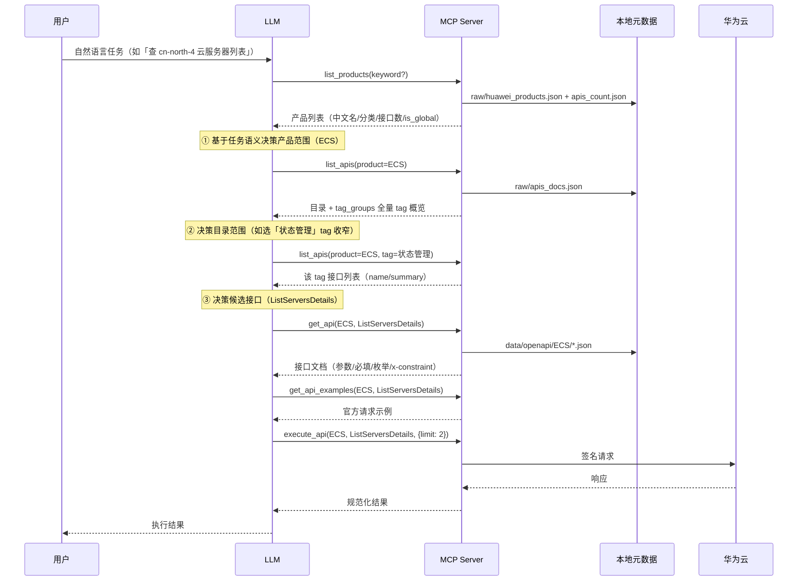
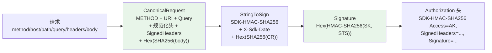
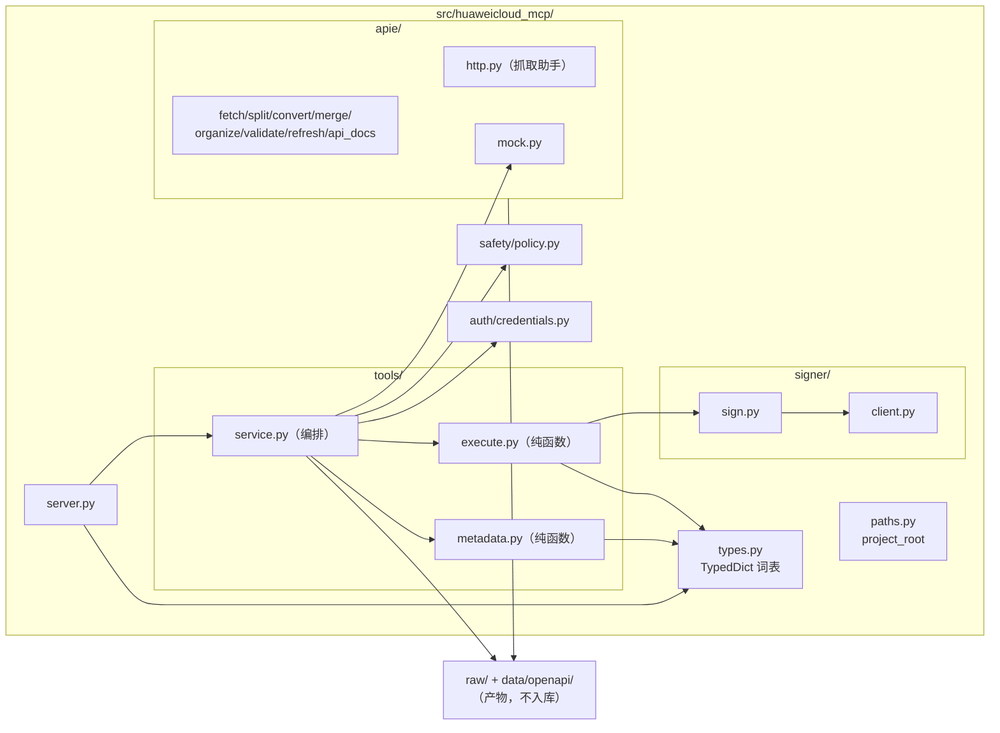
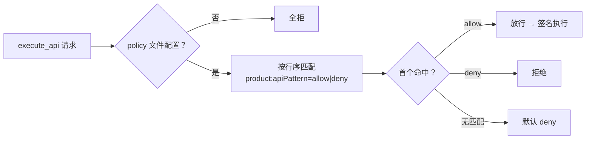
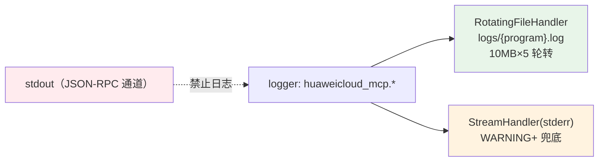

# 华为云 Open MCP 设计文档

> 本地 stdio 形态的华为云 Open MCP server（通用网关 Core 模式）：6 个核心工具编排触达华为云全量 OpenAPI。
> 同类产品参考：[阿里云 OpenAPI MCP Server](https://github.com/aliyun/alibabacloud-api-mcp-server)（Core 模式）、[AWS Labs MCP](https://github.com/awslabs/mcp)。

## 1. 定位与设计目标

| 目标 | 说明 |
| --- | --- |
| 全量覆盖 | 218 产品 / 17666 接口，通过元数据驱动而非逐服务编码 |
| 上下文可控 | 永不把全量 API 塞入 LLM 上下文，LLM 渐进收窄（产品 → 目录 → 接口 → 执行） |
| 零 SDK 依赖 | SDK-HMAC-SHA256 签名自实现，执行层元数据驱动直连 HTTP |
| 安全前置 | `execute_api` 强制过 safety policy（阿里云式 allowlist/denylist） |
| 可验证 | 全链可 mock（API Explorer mock 端点），TDD 五接缝 |

## 2. 总体架构



分层职责：

| 层 | 模块 | 职责 | 依赖方向 |
| --- | --- | --- | --- |
| 网关 | `server.py` | 只做 MCP 协议装配（stdio、工具 schema、instructions） | → service |
| 编排 | `tools/service.py` | 数据加载、配置（region/mock/policy/凭证）、客户端工厂注入 | → 纯函数层 / apie / signer |
| 纯函数 | `tools/metadata.py` `tools/execute.py` | 元数据处理与请求构建/响应规范化，不碰磁盘、不碰 MCP 协议 | → types |
| 安全 | `safety/policy.py` | policy 解析与匹配（PolicyRule dataclass） | 无依赖 |
| 执行 | `signer/` `apie/mock.py` | 签名直连 / mock 端点 | → types / auth |
| 元数据 | `apie/` | APIE 管道 + CLI（可独立运行） | → paths |

## 3. APIE 元数据管道



- 阶段编排：`api-refresh`（count → products → docs → details → retry → split → convert → merge → organize → validate），产物存在自动跳过，`--force` 全重跑
- 断点约定：`raw/apis_detail_partial.json`（done/failed），50 条一次 checkpoint；429 由 `retry` 阶段大退避重试；`APIEXPLORER.1055` 去 region_id 兜底
- region 规则：默认 `cn-north-4` 平铺，非默认 region 带 `{region}` 目录/后缀
- 全部产物可重建，不入库（gitignore）

## 4. MCP 请求数据流

### 4.1 渐进式工作流（LLM 决策驱动收窄）



设计要点：

- **指令承载**：完整工作流写在 server instructions（initialize 响应），各工具 description 标注流程角色（①选产品 → ②定目录 → ③读文档 → ④执行）
- **目录决策支撑**：`list_apis` 返回 `tag_groups`（产品全量 tag 概览，按接口数降序，不受 tag/search/分页过滤影响）——LLM 一次调用即可决策收窄策略
- **为何移除 suggest_apis**：任务→API 的关键词匹配（bigram 加权）准确率远低于 LLM 语义理解；渐进收窄每步上下文可控、可解释、可低成本重试，与阿里云 Core 最佳实践一致

### 4.2 execute_api 内部流程

```mermaid
flowchart TD
    A["tools/call execute_api<br/>(product, api, region, params)"]
    B["service: load_api_doc<br/>data/openapi/{Product}/*.json<br/>定位 (doc, path, method, op)"]
    C{"接口找到？"}
    D{"safety policy 配置？"}
    E{"evaluate(product, api)"}
    F{"mock 模式？"}
    G["build_request<br/>{project_id}←凭证 / query / body 归类"]
    H["signer.sign_request<br/>SDK-HMAC-SHA256"]
    I["HttpClient.request<br/>直连 https://{host}{path}<br/>429 指数退避"]
    J["MockApiClient.mock_request<br/>/v1/mock/{P}/{api}?status_code&number"]
    K["normalize_response<br/>2xx→body / 错误→error_code+error_msg<br/>超 200KB 截断"]
    L["返回 ExecuteResult"]

    A --> B --> C
    C -->|否| X1[{"ok:false, reason:接口未找到"}]
    C -->|是| D
    D -->|否| X2[{"ok:false, reason:policy 未配置"}]
    D -->|是| E
    E -->|deny| X3[{"ok:false, reason:policy 拒绝"}]
    E -->|allow| F
    F -->|是| J --> K --> L
    F -->|否| G --> H --> I --> K --> L

    style D fill:#fff3e0
    style E fill:#fff3e0
    style H fill:#e8f5e9
```

### 4.3 签名算法（SDK-HMAC-SHA256）



- 与官方 Go SDK 行为一致：SignedHeaders 排除 content-type* 与含 `_` 的头；host 不参与签名头列表；content-type 非 json/bson 时 payload 哈希为 `UNSIGNED-PAYLOAD`
- **验证真值**：官方 Go SDK 测试向量（2 个签名值吻合）+ 真实华为云 IAM/ECS 调用 200 + 错误 SK 401/403

### 4.4 Mock 模式

- 端点：`https://apiexplorer.cn-north-4.myhuaweicloud.com/v1/mock/{product_short}/{api_name}?status_code=200&number=1&region_id={region}`
- 行为（实测）：开放端点无需凭证；HTTP 状态恒为 200；`status_code=200` 返回与真实 API 同构的 mock 数据，其它值返回空 body
- 用途：集成测试（S4）、`--mock` 启动参数下无凭证全链路演示；错误路径（429/4xx/5xx）由单元层 urllib 打桩覆盖

## 5. 模块组织



### 类型设计（结果信封）

- 共享 TypedDict 词表（`types.py`）：`ClientResponse` / `ExecuteResult` / `ToolError` + 六工具结果信封（均含 `ok: Literal[True]`）
- 纯函数直接产出完整信封；失败态 `ToolError(ok: Literal[False], reason)` 由编排层构造——服务方法返回 `X | ToolError` 联合
- `ApiDetailResult` 用函数式 TypedDict 承载非标识符键 `x-constraint`
- mypy 全量检查：`disallow_untyped_defs`，29 个源文件 0 错误

## 6. 安全设计



- 策略语法：每行 `product:apiPattern=action`，fnmatch 通配，`*` 代表全部；`#` 注释；文件支持 JSON 数组（保序）或纯文本
- 默认行为：无 policy 文件时 `execute_api` 全拒（`configs/safety-policy.example.json` 提供只读白名单示例）
- 纵深防御：policy 白名单 + 最小权限 IAM 用户的 AK/SK
- 凭证约定：`HUAWEICLOUD_SDK_AK/SK/SECURITY_TOKEN/PROJECT_ID`（env 或 `~/.huaweicloud/credentials` [basic]）；E2E 测试从项目根 `.env` 加载（gitignore，已存在环境变量优先）

## 7. 可观测性（日志）



- **配置**：`logconf.configure_logging(program, level, log_file)`；`--log-level`/`--log-file` 参数与环境变量 `HUAWEICLOUD_MCP_LOG_LEVEL/FILE`；默认 INFO
- **审计（INFO）**：`execute {product}:{api} region=.. mode=real|mock policy=allow|deny|unconfigured`；HTTP 请求 `GET https://host/path -> 200 (123ms)`；server 启动摘要（region/mock/policy/凭证状态）
- **运行（WARNING）**：429 退避重试、policy 拒绝、抓取失败、Swagger 校验 INVALID
- **脱敏红线**：`Authorization`/`X-Security-Token`/AK/SK 永不入日志；请求 body 仅 DEBUG 且截断 500 字符；测试用 caplog 断言红线
- **CLI**：api-refresh/api-docs 全部进度/错误迁至 logging（stderr），stdout 仅保留结构化输出（emit 表格/JSON）

## 8. 测试与 TDD

| 接缝 | 内容 | 测试方式 | 独立真值 |
| --- | --- | --- | --- |
| S1 | `signer.sign(request) → Authorization 头` | 纯函数单测 | 华为云官方 Go SDK 测试向量 |
| S2 | `safety.evaluate(policy, product, api)` | 纯函数单测 | 手写策略文件 + 预期字面量 |
| S3 | 6 工具纯函数 | 单测，迷你样本 fixture | 自建迷你 OpenAPI 片段 |
| S4 | `execute_api` HTTP 边界 | 集成测试直连 mock 端点 + urllib 打桩错误注入 | mock 端点返回 |
| S5 | APIE 管道各阶段 | 单测 + 迷你样本集成 + e2e 全量 | Swagger 2.0 schema |

纪律：red→green 垂直切片；只 mock 系统边界（外部 HTTP）；期望值来自独立真值，禁止同义反复。

## 9. 已实现能力清单

- [x] APIE 全量管道：218 产品 / 17666 接口 → 2714 OpenAPI 2.0 文档，Swagger 校验 invalid=0
- [x] 6 工具：list_products / get_product / list_apis（含 tag_groups）/ get_api / get_api_examples / execute_api
- [x] server instructions + 渐进式工作流指引
- [x] SDK-HMAC-SHA256 签名（官方向量 + 真实云验证）
- [x] safety policy（阿里云式白名单，无 policy 全拒）
- [x] mock 模式全链路（`--mock`）
- [x] 类型系统：TypedDict 结果信封 + mypy 0 错误
- [x] 131 单测+集成 / 6 e2e（真实凭证 3 + 渐进式工作流 3，`.env` 加载）
- [x] 日志体系：文件为主轮转 + stderr 兜底，execute 审计，脱敏红线

## 10. 二期路线

- 远程形态：Streamable HTTP + OAuth（分层已预留，service 与协议解耦）
- `wait_job`：ECS 异步 job 轮询固化（当前 LLM 可经 execute_api 自行轮询 QueryJobStatus）
- 全局级服务完善：domain_id 凭证流与 IAM token 支持
- 多 region 执行：非默认 region 元数据批量抓取与运行时切换
- 文档检索工具：类比阿里云 SearchDocument/ReadDocument（华为云帮助文档）
- 自定义版：把高频 API 直接暴露为单工具（收敛后固化）
