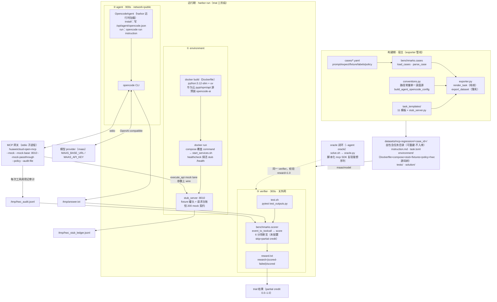
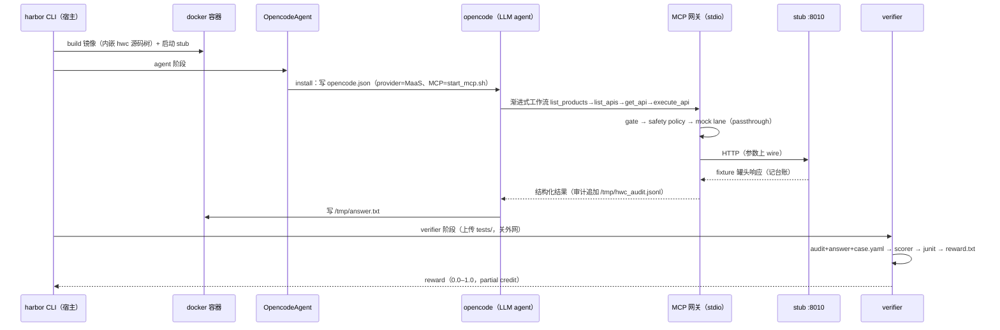

# Harbor 评测集成架构

> `benchmarks/harbor/` 将 openapi 模式的 LLM Agent 级 benchmark 接入 [Harbor](https://github.com/laude-institute/harbor) 评测框架：同一批 case + scorer 语义，经 exporter 渲染为自包含 Harbor 任务目录（`datasets/mcp-regression/`，可重建不入库），由 harbor CLI 编排 trial 三阶段（environment → agent → verifier）产出 partial credit reward。benchmark 用例 schema 与分层评分口径见 [benchmarks/README.md](../benchmarks/README.md)。

## 1. 总体架构

## 2. trial 时序

## 3. 关键约定

| 约定 | 值 / 规则 |
| --- | --- |
| 路径常量单一真值源 | `conventions.py`（stub :8010、`/tmp/hwc_audit.jsonl`、`/tmp/answer.txt`、容器内 `/opt/hwc`、task org `mcp`），exporter 经 `__TOKEN__` 注入全部模板，`start_mcp.sh ≡ task.toml mcp_servers ≡ opencode.json` 三处共用同一命令 |
| 评分语义共享 | verifier 的 `test_outputs.py` 经内嵌 hwc 树（`PYTHONPATH=/opt/hwc`）复用 `benchmarks.scorer`；`scorer.event_to_toolcall` 是审计 NDJSON → trace 输入的唯一口径（legacy runner 与 harbor verifier 双消费者） |
| agent 网络口径 | agent 阶段 `network_mode=public`（LLM 外呼）；严格隔离部署时 environment/verifier 改回 no-network |
| 运行期零下载 | opencode 在 build 期经华为云 npm/apt 源预装（1.18.25）；pypi 依赖经 `uv export + pip` 走华为云镜像 |
| harbor 依赖边界 | 本项目不声明 harbor 依赖（其要求 py>=3.12）；`opencode_agent.py` 仅在 harbor 运行时进程内 import 基类 |
| oracle 闭环 | `--agent oracle` 跑 `solution/solve.sh → oracle.py`（脚本化 mcp SDK 复现理想序列），与 agent 共用同一 verifier，实测 reward 1.0 校验 environment+verifier 闭环 |
