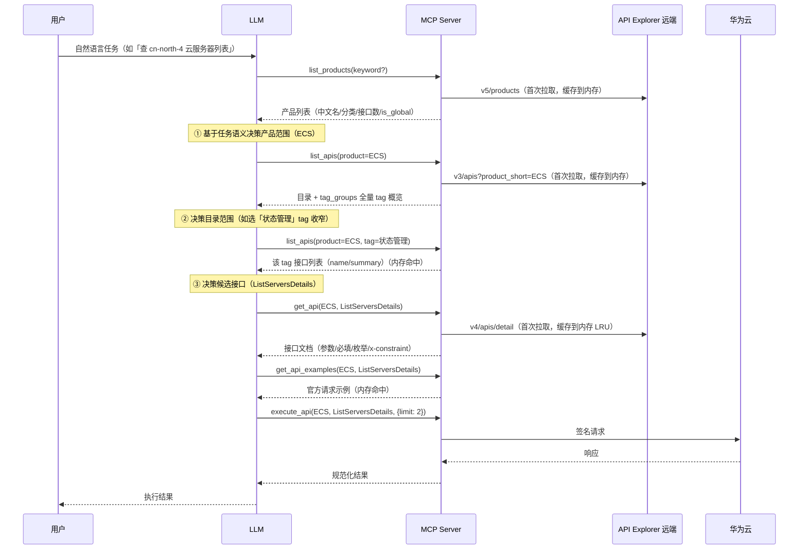
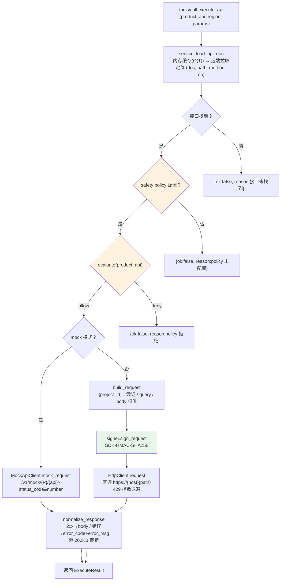
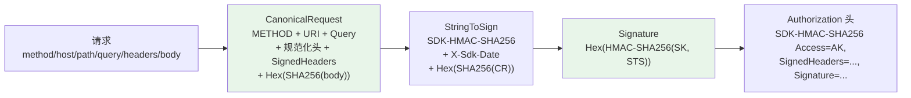
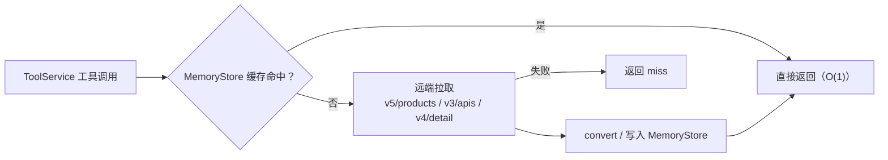
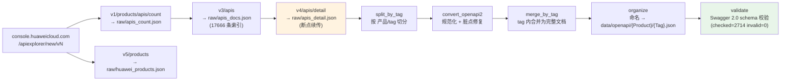
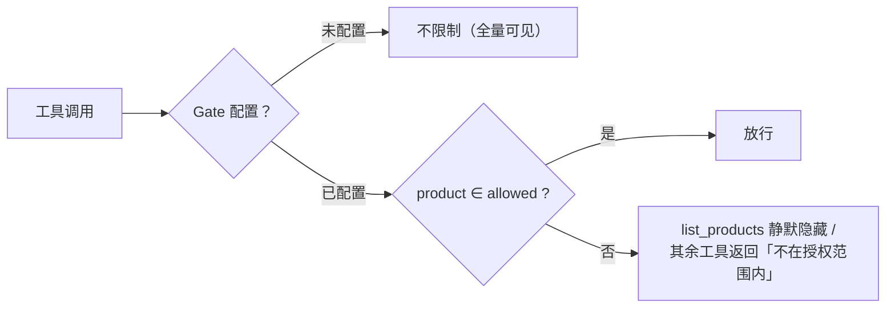
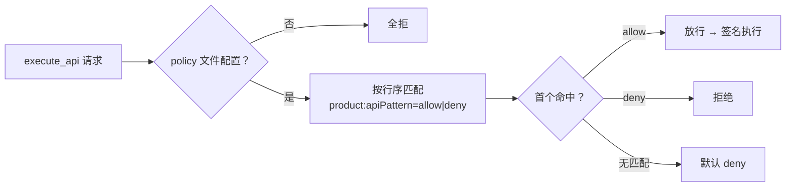

# 华为云 Open MCP —— openapi 模式设计

> 7 个核心工具直连华为云 OpenAPI（Core 模式，默认）。discover 模式见 [mcp-discovery.md](mcp-discovery.md)；跨模式整体架构见 [architecture.md](architecture.md)。

## 1. 定位与设计目标

| 目标 | 说明 |
| --- | --- |
| 全量覆盖 | 219 产品 / 17666 接口，通过元数据驱动而非逐服务编码 |
| 上下文可控 | 永不把全量 API 塞入 LLM 上下文，LLM 渐进收窄（产品 → 目录 → 接口 → 执行） |
| 零 SDK 依赖 | SDK-HMAC-SHA256 签名自实现，执行层元数据驱动直连 HTTP |
| 安全前置 | `execute_api` 强制过 safety policy（阿里云式 allowlist/denylist） |
| 可验证 | 全链可 mock（API Explorer mock 端点），TDD 接缝 S1–S5（S6 benchmark 见 architecture.md） |

## 2. 渐进式工作流（LLM 决策驱动收窄）



设计要点：

- **指令承载**：完整工作流写在 server instructions（initialize 响应），各工具 description 标注流程角色（①选产品 → ②定目录 → ③读文档 → ④执行）
- **目录决策支撑**：`list_apis` 返回 `tag_groups`（产品全量 tag 概览，按接口数降序，不受 tag/search/分页过滤影响）——LLM 一次调用即可决策收窄策略
- **为何移除 suggest_apis**：任务→API 的关键词匹配（bigram 加权）准确率远低于 LLM 语义理解；渐进收窄每步上下文可控、可解释、可低成本重试，与阿里云 Core 最佳实践一致

## 3. execute_api 内部流程



### 3.1 OBS 预签发 URL（对象数据面 presign 单口径）

OBS 对象字节搬运接口（PutObject / GetObject / AppendObject / UploadPart）**恒**经预签发 URL——真实模式下无需任何标志，gate/policy 判定通过后仅签发访问 URL（内部走 OBS「URL 中携带签名」口径，Expires 替换 Date 位），客户端拿 URL 直连 OBS 收发：

```jsonc
// 下载：返回 {ok:true, presign:{url, method:"GET", expires_in}}
execute_api("OBS", "GetObject", params={"bucket_name":"b", "object_key":"a.zip"})
// 上传：返回 {ok:true, presign:{url, method:"PUT", ...}}；可锁 Content-Type
execute_api("OBS", "PutObject", params={"bucket_name":"b", "object_key":"a.zip",
                                        "_presign_content_type": "application/octet-stream"})
// _presign_expires 相对秒数默认 900；显式 _presign=true 对非名单 OBS 接口仍可手动签 URL
```

语义要点：
- **单口径**：名单接口不再提供 gateway 直传（无 body 过手），`presign.method` 即客户端应发起的动词；桶管理类接口（CreateBucket/SetBucketTagging 等）仍由 gateway 直连执行；
- **部署拓扑无关**：server 可本地或远程，字节流都在「发起调用的那台机器 ↔ OBS」之间完成；不限大小、进度归客户端宿主能力；
- **安全等价于原 API**：签发同样过 gate/safety policy（如 `OBS:GetObject=allow`），未授权即拒绝；URL 自带过期时间；
- **mock 豁免**：--mock 模式下名单接口继续走 mock 端点。

## 4. 签名算法（SDK-HMAC-SHA256）



- 与官方 Go SDK 行为一致：SignedHeaders 排除 content-type* 与含 `_` 的头；host 不参与签名头列表；content-type 非 json/bson 时 payload 哈希为 `UNSIGNED-PAYLOAD`
- **验证真值**：官方 Go SDK 测试向量（2 个签名值吻合）+ 真实华为云 IAM/ECS 调用 200 + 错误 SK 401/403

## 5. Mock 模式

- 端点：`https://apiexplorer.cn-north-4.myhuaweicloud.com/v1/mock/{product_short}/{api_name}?status_code=200&number=1&region_id={region}`
- 行为（实测）：开放端点无需凭证；HTTP 状态恒为 200；`status_code=200` 返回与真实 API 同构的 mock 数据，其它值返回空 body
- 用途：集成测试（S4）、`--mock` 启动参数下无凭证全链路演示；错误路径（429/4xx/5xx）由单元层 urllib 打桩覆盖
- `--mock-base`（环境变量 `HUAWEICLOUD_MCP_MOCK_BASE`）可自定义端点基础地址：benchmark 本地 stub 用（确定性响应隔离网络抖动）

## 6. 元数据内存缓存

不依赖本地 `data/openapi/` 磁盘产物，元数据全部从 API Explorer 远端实时获取，纯内存缓存：



三层缓存策略：

| 缓存层 | 键 | 容量 | 生命周期 |
|---|---|---|---|
| `_products` | 无（单例） | 1 条 | 进程存活 |
| `_apis` | `product_lower` | 按访问产品数 | 进程存活 |
| `_api_details` | `(product_lower, api_name, region)` | 500 LRU | 按访问淘汰 |

远端端点：

| 数据 | 端点 | 缓存位置 |
|---|---|---|
| 产品列表 | `v5/products` | `_products` |
| 单产品 API 列表 | `v3/apis?product_short=ECS` | `_apis[ecs]` |
| API 详情 | `v4/apis/detail?product_short=ECS&name=ListServers` | `_api_details` |

## 7. APIE 元数据管道



- 阶段编排：`api-refresh`（count → products → docs → details → retry → split → convert → merge → organize → validate），产物存在自动跳过，`--force` 全重跑
- 断点约定：`raw/apis_detail_partial.json`（done/failed），50 条一次 checkpoint；429 由 `retry` 阶段大退避重试；`APIEXPLORER.1055` 去 region_id 兜底
- region 规则：默认 `cn-north-4` 平铺，非默认 region 带 `{region}` 目录/后缀
- 全部产物可重建，不入库（gitignore）

## 8. 产品准入门栓（Gate）

`src/mcp_openapi/gate.py`：产品级白名单，控制哪些产品可经 openapi 模式可见/调用。



- 配置：`configs/openapi-gate.example.json`（`{"products": ["ECS", "VPC"]}`），CLI `--gate` / 环境变量 `HUAWEICLOUD_MCP_OPENAPI_GATE`
- 默认语义：未配置 → 不限制（opt-in）；配置后严格白名单，未列出产品默认拒
- 门控范围：`list_products` 静默隐藏越界产品；`get_product`/`list_apis`/`get_api`/`get_api_examples`/`execute_api` 返回「产品 X 不在 openapi mcp 授权范围内」
- 提示词层级：`build_instructions(gate)` 把授权范围注入 instructions，各工具 docstring 附「仅授权产品可见/可调用」提示
- 双层：`execute_api` 先过门栓（产品粗滤）再过 safety policy（API 细规则）
- 按 productshort 匹配（大小写不敏感）；`api-docs` CLI 不受门栓影响

## 9. 安全设计（product 规则）



- 策略语法：每行 `product:apiPattern=action`，fnmatch 通配，`*` 代表全部；`#` 注释；文件支持 JSON 数组（保序）或纯文本
- 默认行为：无 policy 文件时 `execute_api` 全拒（`configs/safety-policy.example.json` 提供只读白名单示例）
- 纵深防御：policy 白名单 + 最小权限 IAM 用户的 AK/SK
- 凭证约定：`HUAWEICLOUD_SDK_AK/SK/SECURITY_TOKEN/PROJECT_ID`（env 或 `~/.huaweicloud/credentials` [basic]）；E2E 测试从项目根 `.env` 加载（gitignore，已存在环境变量优先）
- server 规则（`server:serverId[:toolPattern]=...`）见 [mcp-discovery.md](mcp-discovery.md)

## 10. 测试接缝（S1–S5，另见 S8 门栓）

| 接缝 | 内容 | 测试方式 | 独立真值 |
| --- | --- | --- | --- |
| S1 | `signer.sign(request) → Authorization 头` | 纯函数单测 | 华为云官方 Go SDK 测试向量 |
| S2 | `safety.evaluate(policy, product, api)` | 纯函数单测 | 手写策略文件 + 预期字面量 |
| S2b | `safety/policy_store.py` PolicyStore（热重载 / 文件↔内存双向同步） | 单测：tmp 文件 + 内容哈希 stat 替身 | 回读磁盘原始内容 + parse_policy 交叉验证 |
| S3 | 各工具纯函数（含 manage_policy 编排） | 单测，迷你样本 fixture | 自建迷你 OpenAPI 片段 |
| S4 | `execute_api` HTTP 边界 | 集成测试直连 mock 端点 + urllib 打桩错误注入 | mock 端点返回 |
| S5 | APIE 管道各阶段 | 单测 + 迷你样本集成 + e2e 全量 | Swagger 2.0 schema |
| S8 | `gate.py` 产品门栓（parse/allows/filter_products/describe/load）+ service 门栓过滤/拒绝 + server 指令注入 | 纯函数单测 + service 注入 gate + server 装配断言 | 门栓示例配置 + 手写字面量 |

S6 benchmark 接缝见 [architecture.md](architecture.md)。纪律：red→green 垂直切片；只 mock 系统边界（外部 HTTP）；期望值来自独立真值，禁止同义反复。